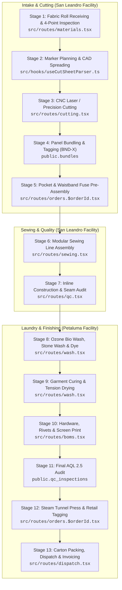

# FORGE & FABRIC INDUSTRIES, INC.
# COMPLETE DIGITAL MES & INDUSTRIAL ERP SPECIFICATION (v2.0)
**Document Status:** Master Production Specification & Unified Architecture Blueprint  
**Authors & Reviewers:** Umair Abbas, Faiz Ijaz, Ahmed Mustafa, Aamar, Isaac, Joe  
**Platform Stack:** React 19 + TanStack Router (Start) + Vite + Supabase PostgreSQL + Tailwind CSS + Zod  
**Operational Scope:** 13-Stage Industrial "Cut, Make, Wash, Pack" (CMT) Conversion Platform across Dual Northern California Facilities (Petaluma Laundry & Distribution + San Leandro Cutting & Sewing)

---

## 📑 TABLE OF CONTENTS
1. [Executive Synthesis & Unified Gap Matrix](#1-executive-synthesis--unified-gap-matrix)
2. [13-Stage Pipeline Architecture & Codebase Map](#2-13-stage-pipeline-architecture--codebase-map)
3. [Deep-Dive Technical Specification of the 13 Unified Requirements](#3-deep-dive-technical-specification-of-the-13-unified-requirements)
   - [REQ-01: Role & User Assignment Mapping + Seamless Dynamic Reassignment](#req-01-role--user-assignment-mapping--seamless-dynamic-reassignment)
   - [REQ-02: Facility Material Receiving (GRN) Approval Ownership & Signature Gate](#req-02-facility-material-receiving-grn-approval-ownership--signature-gate)
   - [REQ-03: Zero-Trust Multi-Brand Multi-Tenant Data Isolation](#req-03-zero-trust-multi-brand-multi-tenant-data-isolation)
   - [REQ-04: Sample Request Controls (Configurable 3-Day Turnaround, 100pc Cap, Approval Gate, Master SKU)](#req-04-sample-request-controls-configurable-3-day-turnaround-100pc-cap-approval-gate-master-sku)
   - [REQ-05: Tech Pack Centralized Storage & Document Vault Architecture](#req-05-tech-pack-centralized-storage--document-vault-architecture)
   - [REQ-06: Purchase Order (PO) Prerequisite Gate for Invoicing & Dispatch](#req-06-purchase-order-po-prerequisite-gate-for-invoicing--dispatch)
   - [REQ-07: New Order Pricing Approval & Merchandising Quoting Workflow](#req-07-new-order-pricing-approval--merchandising-quoting-workflow)
   - [REQ-08: Universal Outsourcing Support for All 13 Production Stages](#req-08-universal-outsourcing-support-for-all-13-production-stages)
   - [REQ-09: Capacity-Based Dynamic Delivery Date Scheduling Engine](#req-09-capacity-based-dynamic-delivery-date-scheduling-engine)
   - [REQ-10: UHF RFID Bundle & Inventory Tracking Architecture (Future Roadmap)](#req-10-uhf-rfid-bundle--inventory-tracking-architecture-future-roadmap)
   - [REQ-11: QuickBooks Online & Advanced ERP (Fishbowl/Ames360) Integration Protocol (Future Roadmap)](#req-11-quickbooks-online--advanced-erp-fishbowlames360-integration-protocol-future-roadmap)
   - [REQ-12: High-Velocity Mobile / Tablet Shop Floor Touch Interface (60px Buttons)](#req-12-high-velocity-mobile--tablet-shop-floor-touch-interface-60px-buttons)
   - [REQ-13: Granular Production Cost, Scrap Yardage & Rework COPQ Tracking](#req-13-granular-production-cost-scrap-yardage--rework-copq-tracking)
4. [Consolidated Database Migration Package (Zero-Regression SQL)](#4-consolidated-database-migration-package-zero-regression-sql)
5. [Actionable Phased Execution Sprints (Chunks 1 to 5)](#5-actionable-phased-execution-sprints-chunks-1-to-5)

---

## 1. Executive Synthesis & Unified Gap Matrix

This document reconciles all directives from executive leadership (Aamar, Isaac, Joe), the technical breakdown by Faiz Ijaz, and the engineering codebase managed by Umair Abbas & Ahmed Mustafa.

| # | Requirement Area | Status in Codebase | What is ALREADY Implemented | What NEEDS to be Implemented (The Delta) | Priority |
|---|---|---|---|---|---|
| **1** | **Role/User Assignment Mapping & Dynamic Reassignment** | 🟡 Partial | RBAC permission matrix in `src/lib/permissions.ts`, User management table in `src/routes/settings.users.tsx`, Profile context in `src/hooks/useAuth.tsx`. | • Seed initial staff accounts: **Pat** ➔ `production_manager`, **Wesley/Joe** ➔ `merchandiser`, **Warehouse Managers** ➔ `warehouse`.<br>• Add 1-click **Dynamic Role & Facility Reassignment** modal in Admin UI so leadership can change roles without recreating accounts. | **High** (Sprint 1) |
| **2** | **Material Receiving Approval Ownership** | 🟡 Partial | GRN log in `src/routes/materials.tsx`, lot inventory in `src/routes/inventory.tsx`, facility assignment (`Sewing Facility` vs `Laundry Facility`). | • Formal **Warehouse Manager Approval Gate** (`approved_by_user_id`, `approved_at`, `digital_signature`, `approval_status`).<br>• Hard floor lock: Quarantined fabric cannot be cut in Stage 2/3. | **High** (Sprint 1) |
| **3** | **Multi-Brand Tenant Isolation** | 🟡 Partial | Memory filtering in `src/components/portal/CustomerPortal.tsx`. | • Enforce strict PostgreSQL Row Level Security (RLS) policies on `orders`, `apply_submissions`, `packing_lists`, `inventory_lots`, and `tech_pack_vault` so brands (*Weissmade*, *Fear of God*, *Servade*, *Levi's*) have zero cross-visibility. | **Critical** (Sprint 1) |
| **4** | **Sample Request Controls & SKU Governance** | 🟡 Partial | `SampleRequestSubform.tsx`, `sampleRequestSchema.ts`, and size matrix breakdown. | • Hard **3-day minimum turnaround** (configurable in Admin settings).<br>• Hard **100 pcs sample cap**.<br>• **"Sample Approved" gate** before bulk PO conversion.<br>• Separation of `client_reference_sku` vs Admin-controlled `master_product_sku` & `quote_number`. | **High** (Sprint 1) |
| **5** | **Tech Pack Centralized Storage** | 🟡 Partial | Supabase Storage buckets active (`apply-documents`, `tech-packs`). | • Structured document vault hierarchy: `storage://tech-packs/{brand}/{style_code}/v{version}/`.<br>• Supabase Storage as high-speed primary single source of truth + automated Google Drive Enterprise cloud archival mirror. | **Medium** (Sprint 2) |
| **6** | **PO Requirement for Invoicing** | 🔴 Pending | Dispatch packing lists in `src/routes/dispatch.tsx`. | • Hard blocking validation: Block invoice generation and POD release if `po_number` or attached signed PO document is missing. | **High** (Sprint 1) |
| **7** | **New Order Pricing Approval Workflow** | 🔴 Pending | Custom intake in `src/routes/apply-intake.tsx` creates pending submissions. | • New unquoted orders receive status `Pending_Pricing_Approval`.<br>• Repeat orders auto-link to existing quotes.<br>• In-app Merchandiser Unit Cost Estimator modal for pricing signoff. | **High** (Sprint 2) |
| **8** | **Universal Outsourcing for All 13 Stages** | 🔴 Pending | Cutting had simple vendor text field; `orders` table has facility. | • Extend outsourcing to **all 13 stages** (Cutting, Sewing assembly, Wash & laundry, Screen Printing / Embroidery, Finishing).<br>• Track vendor name, outsource PO #, dispatch quantity, expected return date, and return receipts. | **High** (Sprint 2) |
| **9** | **Capacity-Based Dynamic Delivery Adjustment** | 🔴 Pending | Static calendar date inputs in intake forms. | • Capacity engine computing active WIP load across Stages 1–12 vs daily line throughput (144,000 units/day) to suggest realistic completion dates. | **Medium** (Sprint 2) |
| **10** | **UHF RFID Tracking Integration** | ⚪ Roadmap (Phase 3) | Barcode / QR bundle scanner in `src/routes/sewing.tsx` (`BND-X`) and `src/routes/cutting.tsx`. | • Hardware integration for UHF EPC Gen2 RFID tags (<$0.10/tag), overhead gate readers, and 2-person custody transfer protocols. | **Low** (Phase 3) |
| **11** | **QuickBooks & ERP Sync (Fishbowl/Ames360)** | ⚪ Roadmap (Phase 3) | Financial metadata active. | • Bi-directional API sync for Customers, Invoices, and Fishbowl/Ames360 WIP labor-hour and inventory costing. | **Medium** (Phase 3) |
| **12** | **Mobile Shop Floor Touch Interface** | 🟢 Mostly Implemented | Mobile responsive layouts via Tailwind CSS across all 13 stage routes. | • Dedicated high-contrast, large-touch operator tablet mode (60px tactile buttons) for fast station check-ins. | **High** (Sprint 2) |
| **13** | **Production Cost & Rework COPQ Tracking** | 🟡 Partial | Defect inspection in `src/routes/qc.tsx` (`qc_records`). | • Station-level rework labor hours, scrap fabric yardage consumed, and Cost of Poor Quality (COPQ) executive financial analytics. | **High** (Sprint 2) |

---

## 2. 13-Stage Pipeline Architecture & Codebase Map



---

## 3. Deep-Dive Technical Specification of the 13 Unified Requirements

---

### REQ-01: Role & User Assignment Mapping + Seamless Dynamic Reassignment

#### 1. Business & Floor Operational Requirements
* System must officially map real team members to system permissions:
  * **Pat** ➔ `Production Manager` (`production_manager` / `production`): Complete control over Cut Tickets, bundle generation, machine capacity, floor stage jumps, and line balancing.
  * **Wesley & Joe** ➔ `Merchandisers` (`merchandiser`): Authority over order intake triage, quotation issuance, pricing approvals, and conversion of approved submissions to active Work Orders.
  * **Local Warehouse Managers** ➔ `Warehouse` (`warehouse`): Exclusive authority to approve Material Receiving (GRN) and log fabric roll inspection test results at Petaluma and San Leandro.
  * **QC Inspectors** ➔ `QC Inspector` (`qc_inspector` / `qc`): Inline audits, 4-point fabric scoring, AQL 2.5 final inspection signoffs.
* **Dynamic Role Reassignment**: Admin must have an in-app User Management modal in [`src/routes/settings.users.tsx`](file:///c:/CYBERSOFT/forge-flow-main/src/routes/settings.users.tsx) allowing instant role and facility switching without deleting or recreating user accounts.

#### 2. Code & Database Implementation
* Files to update: [`src/lib/permissions.ts`](file:///c:/CYBERSOFT/forge-flow-main/src/lib/permissions.ts), [`src/hooks/useAuth.tsx`](file:///c:/CYBERSOFT/forge-flow-main/src/hooks/useAuth.tsx), [`src/routes/settings.users.tsx`](file:///c:/CYBERSOFT/forge-flow-main/src/routes/settings.users.tsx).
* Seed Data SQL:
```sql
INSERT INTO public.profiles (id, email, full_name, role, facility_scope, status)
VALUES
  ('usr-pat-prod', 'pat@forgefabric.com', 'Pat (Production Manager)', 'production_manager', 'San Leandro Cutting & Sewing', 'active'),
  ('usr-wesley-merch', 'wesley@forgefabric.com', 'Wesley (Senior Merchandiser)', 'merchandiser', 'All', 'active'),
  ('usr-joe-merch', 'joe@forgefabric.com', 'Joe (Merchandising Lead)', 'merchandiser', 'All', 'active'),
  ('usr-wh-petaluma', 'warehouse.petaluma@forgefabric.com', 'Petaluma Warehouse Supervisor', 'warehouse', 'Petaluma Distribution & Laundry', 'active'),
  ('usr-wh-sanleandro', 'warehouse.sanleandro@forgefabric.com', 'San Leandro Warehouse Supervisor', 'warehouse', 'San Leandro Cutting & Sewing', 'active')
ON CONFLICT (id) DO UPDATE SET
  role = EXCLUDED.role,
  facility_scope = EXCLUDED.facility_scope;
```

---

### REQ-02: Facility Material Receiving (GRN) Approval Ownership & Signature Gate

#### 1. Floor Workflow & Quality Gate
* When denim rolls, pocketing canvas, zippers, or rivets arrive at Petaluma or San Leandro:
  1. Receiving operator logs BOL #, measured yardage, GSM, and 4-point inspection defect score.
  2. The material status defaults to `Quarantine_Pending_Approval`.
  3. Only the designated facility Warehouse Manager (or Admin) can click **"Approve & Release to Production"**.
* **Floor Lockout**: Unapproved rolls cannot be selected or allocated in the Cut Ticket creation module ([`src/routes/cutting.tsx`](file:///c:/CYBERSOFT/forge-flow-main/src/routes/cutting.tsx)).

#### 2. Schema DDL
```sql
ALTER TABLE IF EXISTS public.materials
  ADD COLUMN IF NOT EXISTS approval_status text DEFAULT 'Approved' CHECK (approval_status IN ('Pending_Approval', 'Approved', 'Rejected', 'Quarantine')),
  ADD COLUMN IF NOT EXISTS approved_by_user_id uuid REFERENCES public.profiles(id),
  ADD COLUMN IF NOT EXISTS approved_by_name text,
  ADD COLUMN IF NOT EXISTS approved_at timestamptz,
  ADD COLUMN IF NOT EXISTS rejection_reason text,
  ADD COLUMN IF NOT EXISTS four_point_score numeric DEFAULT 0,
  ADD COLUMN IF NOT EXISTS shade_lot_matching_passed boolean DEFAULT true;
```

---

### REQ-03: Zero-Trust Multi-Brand Multi-Tenant Data Isolation

#### 1. Zero-Trust Security Protocol
* Brands (*Weissmade*, *Fear of God*, *Servade*, *Levi Strauss & Co.*, *Zara Denim*, *Uniqlo*, *Nudie Jeans*) compete in the market and must have **zero cross-brand data leakage**.
* PostgreSQL Row Level Security (RLS) guarantees that customer users can strictly query only rows where `company_id` matches their JWT claim or `customer_name` matches their account.

#### 2. PostgreSQL RLS Policies
```sql
ALTER TABLE public.orders ENABLE ROW LEVEL SECURITY;
DROP POLICY IF EXISTS "orders_tenant_isolation" ON public.orders;
CREATE POLICY "orders_tenant_isolation" ON public.orders
FOR ALL TO authenticated
USING (
  (auth.jwt()->>'role' IN ('admin', 'super_admin', 'merchandiser', 'production', 'production_manager', 'qc', 'qc_inspector', 'warehouse'))
  OR
  (
    auth.jwt()->>'role' = 'customer' AND (
      company_id::text = (auth.jwt()->>'company_id')
      OR LOWER(customer_name) = LOWER(auth.jwt()->>'customer_name')
    )
  )
);
```

---

### REQ-04: Sample Request Controls (Configurable 3-Day Turnaround, 100pc Cap, Approval Gate, Master SKU)

#### 1. Production Rules & Constraints
1. **Configurable Minimum 3-Day Turnaround**:
   * Default setting: Minimum 3 business days from submission date.
   * Calendar picker in [`SampleRequestSubform.tsx`](file:///c:/CYBERSOFT/forge-flow-main/src/components/apply-portal/subforms/SampleRequestSubform.tsx) disallows earlier dates.
   * Configurable in Admin Settings (`sample_min_turnaround_days` in `tenant_branding`).
2. **Strict 100 Pcs Maximum Quantity Cap**:
   * Sample requests with $> 100$ total units are blocked by schema validation with error: *"Sample limit exceeded: Orders over 100 pcs must be submitted as New Bulk Production Orders."*
3. **Sample Approval Gate before Bulk PO Conversion**:
   * Sample lifecycle: `Sample_Requested` ➔ `In_Sample_Making` ➔ `Sample_Completed` ➔ `Sample_Approved`.
   * The **"Convert to Bulk Production PO"** action remains disabled until `Sample_Approved` is recorded.
4. **Master SKU & Official Quote Authority**:
   * Customer enters their internal `client_reference_sku` (e.g. `WM-SS26-01`).
   * Forge & Fabric's official `master_product_sku` (e.g. `FF-2026-DNM-0089`) and `official_quote_number` (e.g. `QUO-2026-0814`) are strictly assigned and locked by Merchandisers.

---

### REQ-05: Tech Pack Centralized Storage & Document Vault Architecture

#### 1. Architecture & Storage Hierarchy
* All uploaded tech packs, spec sheets, wash reference photos, and embroidery files are consolidated into a centralized vault:
  `storage://tech-packs/{customer_name}/{style_code}/v{version_number}/{filename}`
* Primary storage: Supabase Storage for high-speed in-app rendering and PDF previews.
* Secondary archival: Webhook mirror to Google Drive Enterprise shared team drive.

#### 2. Database Schema DDL
```sql
CREATE TABLE IF NOT EXISTS public.tech_pack_vault (
  id uuid PRIMARY KEY DEFAULT gen_random_uuid(),
  company_id uuid REFERENCES public.companies(id),
  customer_name text NOT NULL,
  style_code text NOT NULL,
  version_number int DEFAULT 1,
  file_name text NOT NULL,
  file_url text NOT NULL,
  file_size_bytes bigint,
  mime_type text DEFAULT 'application/pdf',
  uploaded_by text,
  is_active boolean DEFAULT true,
  change_notes text,
  created_at timestamptz DEFAULT now()
);
```

---

### REQ-06: Purchase Order (PO) Prerequisite Gate for Invoicing & Dispatch

#### 1. Invoicing Constraint Gate
* When a user attempts to generate an invoice or finalize a Dispatch POD in [`src/routes/dispatch.tsx`](file:///c:/CYBERSOFT/forge-flow-main/src/routes/dispatch.tsx):
  * System checks if `order.po_number` exists and is non-empty.
  * System checks if a linked PO document or submission reference exists.
  * If missing, invoicing is blocked with modal: *"Cannot generate invoice — No valid Purchase Order linked to this order. Please attach PO before proceeding."*

---

### REQ-07: New Order Pricing Approval & Merchandising Quoting Workflow

#### 1. Quoting Engine & Workflow
* **Unquoted Order Triage**: Custom intake submissions without an existing pre-approved quote are assigned status `Pending_Pricing_Approval`.
* **Repeat Orders Auto-Link**: If the customer selects an existing style/quote ID, the system auto-links pricing and skips approval.
* **Merchandiser Unit Price Calculator**:
  $$\text{Final Unit Price} = \text{CMT Base Labor} + \text{Wash Surcharge} + \text{Trims/Packing Surcharge} + \text{Factory Margin}$$
* Issued Quote is sent to Customer Portal for digital acceptance before active Cut Tickets are released.

#### 2. Database Schema DDL
```sql
CREATE TABLE IF NOT EXISTS public.price_quotes (
  id uuid PRIMARY KEY DEFAULT gen_random_uuid(),
  quote_number text UNIQUE NOT NULL,
  submission_id uuid REFERENCES public.apply_submissions(id),
  customer_name text NOT NULL,
  style_name text NOT NULL,
  quantity int NOT NULL,
  cmt_unit_cost numeric(10,2) NOT NULL,
  wash_unit_cost numeric(10,2) DEFAULT 0,
  trims_unit_cost numeric(10,2) DEFAULT 0,
  final_unit_price numeric(10,2) NOT NULL,
  total_contract_value numeric(12,2) NOT NULL,
  status text DEFAULT 'Draft' CHECK (status IN ('Draft', 'Sent_To_Customer', 'Accepted', 'Rejected', 'Expired')),
  issued_by text NOT NULL,
  accepted_at timestamptz,
  created_at timestamptz DEFAULT now()
);
```

---

### REQ-08: Universal Outsourcing Support for All 13 Production Stages

#### 1. Multi-Stage Vendor Outsourcing
* The system allows outsourcing **any of the 13 stages** (e.g. TJ Maxx custom bag project where cutting is in LA, screen printing is outsourced, and finishing is in-house).
* Tracks: `stage_number`, `vendor_name`, `vendor_facility_location`, `outsource_po_number`, `dispatched_quantity`, `expected_return_date`, `received_quantity`, `vendor_status`, and `unit_cost_usd`.

#### 2. Database Schema DDL
```sql
CREATE TABLE IF NOT EXISTS public.stage_outsourcing_records (
  id uuid PRIMARY KEY DEFAULT gen_random_uuid(),
  order_id text NOT NULL,
  stage_number int NOT NULL,
  stage_name text NOT NULL,
  vendor_name text NOT NULL,
  vendor_facility_location text NOT NULL,
  outsource_po_number text NOT NULL,
  quantity_dispatched int NOT NULL,
  quantity_received int DEFAULT 0,
  unit_cost_usd numeric(10,2) DEFAULT 0,
  total_cost_usd numeric(10,2) DEFAULT 0,
  dispatched_at timestamptz DEFAULT now(),
  expected_return_at timestamptz NOT NULL,
  received_at timestamptz,
  vendor_status text DEFAULT 'Dispatched' CHECK (vendor_status IN ('Dispatched', 'In_Process', 'Returned_Partial', 'Returned_Complete', 'Defect_Hold')),
  notes text,
  created_at timestamptz DEFAULT now()
);
```

---

### REQ-09: Capacity-Based Dynamic Delivery Date Scheduling Engine

#### 1. Shop Floor Load Calculation Engine
* Evaluates total floor capacity:
  * **Daily Line Capacity:** 144,000 units/day across all cutting, sewing, and laundry lines.
  * **Current WIP Backlog:** Total active units occupying Stages 1–12.
* **Suggested Date Calculation:**
  $$\text{Earliest Ship Date} = \text{Today} + \left\lceil \frac{\text{Active Backlog Units} + \text{New Order Units}}{\text{Daily Line Capacity}} \right\rceil + \text{Laundry Buffer (2 Days)}$$
* Displayed dynamically in order creation and intake approval screens.

---

### REQ-10: UHF RFID Bundle & Inventory Tracking Architecture (Future Roadmap)

#### 1. Technical Architecture (Phase 3)
* Tag Specification: EPCglobal Class 1 Gen 2 / ISO 18000-6C UHF RFID Inlays (<$0.10/tag).
* Tag Encoding: Assigned dynamically at Stage 4 Cut Bundle generation.
* Portal Readers: Fixed Alien/Impinj readers at factory line gateways (Cutting exit, Sewing entry, Laundry entry).
* Handheld Terminals: Zebra TC26 Android terminals for mobile floor spot audits.

---

### REQ-11: QuickBooks Online & Advanced ERP (Fishbowl/Ames360) Integration Protocol (Future Roadmap)

#### 1. Financial Architecture (Phase 3)
* **QuickBooks Online Sync**:
  * Auto-sync newly verified Customers to QBO.
  * Auto-generate Draft Invoices upon Stage 13 POD signoff linked to customer PO.
* **ERP Costing Layer (Fishbowl / Ames360)**:
  * Full bill of materials costing, machine run-time hours, and true manufacturing variance reporting.

---

### REQ-12: High-Velocity Mobile / Tablet Shop Floor Touch Interface (60px Buttons)

#### 1. Workstation Touch Interface
* Dedicated operator view designed for 10-inch Android/iPad touchscreen tablets mounted at sewing and wash workstations.
* **60px Large-Touch Targets**: High-contrast buttons designed for operators wearing protective work gloves.
* Operator Workflow:
  1. Scan Operator Badge Barcode.
  2. Scan Bundle Barcode (`BND-17`).
  3. One-tap actions: `START BUNDLE`, `LOG PASS`, `LOG DEFECT`, `COMPLETE STAGE`.

---

### REQ-13: Granular Production Cost, Scrap Yardage & Rework COPQ Tracking

#### 1. Quality Costing Architecture
* Captures detailed rework data for garments failing Stage 7 (Inline Audit) or Stage 11 (AQL Audit):
  * `labor_minutes_spent`: Time spent fixing seam/stitch errors.
  * `scrap_yards_consumed`: Extra raw fabric yards cut to replace damaged panels.
  * `calculated_copq_usd`: Direct financial loss calculated from labor + fabric scrap.
* Rendered in Executive Analytics as **Cost of Poor Quality (COPQ)** trend lines by brand, operator, and machine line.

#### 2. Database Schema DDL
```sql
CREATE TABLE IF NOT EXISTS public.rework_logs (
  id uuid PRIMARY KEY DEFAULT gen_random_uuid(),
  order_id text NOT NULL,
  stage_number int NOT NULL,
  station_name text NOT NULL,
  defect_type text NOT NULL,
  quantity_reworked int NOT NULL,
  operator_id text,
  labor_minutes_spent int DEFAULT 0,
  scrap_yards_consumed numeric(10,2) DEFAULT 0,
  calculated_copq_usd numeric(10,2) DEFAULT 0,
  logged_by text NOT NULL,
  created_at timestamptz DEFAULT now()
);
```

---

## 4. Consolidated Database Migration Package (Zero-Regression SQL)

This consolidated migration script implements all tables, columns, constraints, and RLS policies required for this specification:

```sql
-- ==============================================================================
-- FORGE & FABRIC INDUSTRIES, INC. — CONSOLIDATED PRODUCTION MES UPGRADE (v2.0)
-- ==============================================================================

-- 1. MATERIAL RECEIVING APPROVALS
ALTER TABLE IF EXISTS public.materials
  ADD COLUMN IF NOT EXISTS approval_status text DEFAULT 'Approved' CHECK (approval_status IN ('Pending_Approval', 'Approved', 'Rejected', 'Quarantine')),
  ADD COLUMN IF NOT EXISTS approved_by_user_id uuid REFERENCES public.profiles(id),
  ADD COLUMN IF NOT EXISTS approved_by_name text,
  ADD COLUMN IF NOT EXISTS approved_at timestamptz,
  ADD COLUMN IF NOT EXISTS rejection_reason text,
  ADD COLUMN IF NOT EXISTS four_point_score numeric DEFAULT 0,
  ADD COLUMN IF NOT EXISTS shade_lot_matching_passed boolean DEFAULT true;

-- 2. SAMPLE REQUEST ENHANCEMENTS
ALTER TABLE IF EXISTS public.sample_requests
  ADD COLUMN IF NOT EXISTS client_reference_sku text,
  ADD COLUMN IF NOT EXISTS master_product_sku text,
  ADD COLUMN IF NOT EXISTS quote_number text,
  ADD COLUMN IF NOT EXISTS sample_status text DEFAULT 'Sample_Requested' CHECK (sample_status IN ('Sample_Requested', 'In_Sample_Making', 'Sample_Completed', 'Sample_Approved', 'Sample_Rejected', 'Converted_To_Bulk')),
  ADD COLUMN IF NOT EXISTS approved_by text,
  ADD COLUMN IF NOT EXISTS approved_at timestamptz;

-- 3. CENTRALIZED TECH PACK VAULT
CREATE TABLE IF NOT EXISTS public.tech_pack_vault (
  id uuid PRIMARY KEY DEFAULT gen_random_uuid(),
  company_id uuid REFERENCES public.companies(id),
  customer_name text NOT NULL,
  style_code text NOT NULL,
  version_number int DEFAULT 1,
  file_name text NOT NULL,
  file_url text NOT NULL,
  file_size_bytes bigint,
  mime_type text DEFAULT 'application/pdf',
  uploaded_by text,
  is_active boolean DEFAULT true,
  change_notes text,
  created_at timestamptz DEFAULT now()
);

-- 4. PRICE QUOTATION & APPROVAL ENGINE
CREATE TABLE IF NOT EXISTS public.price_quotes (
  id uuid PRIMARY KEY DEFAULT gen_random_uuid(),
  quote_number text UNIQUE NOT NULL,
  submission_id uuid REFERENCES public.apply_submissions(id),
  customer_name text NOT NULL,
  style_name text NOT NULL,
  quantity int NOT NULL,
  cmt_unit_cost numeric(10,2) NOT NULL,
  wash_unit_cost numeric(10,2) DEFAULT 0,
  trims_unit_cost numeric(10,2) DEFAULT 0,
  final_unit_price numeric(10,2) NOT NULL,
  total_contract_value numeric(12,2) NOT NULL,
  status text DEFAULT 'Draft' CHECK (status IN ('Draft', 'Sent_To_Customer', 'Accepted', 'Rejected', 'Expired')),
  issued_by text NOT NULL,
  accepted_at timestamptz,
  created_at timestamptz DEFAULT now()
);

-- 5. UNIVERSAL STAGE OUTSOURCING
CREATE TABLE IF NOT EXISTS public.stage_outsourcing_records (
  id uuid PRIMARY KEY DEFAULT gen_random_uuid(),
  order_id text NOT NULL,
  stage_number int NOT NULL,
  stage_name text NOT NULL,
  vendor_name text NOT NULL,
  vendor_facility_location text NOT NULL,
  outsource_po_number text NOT NULL,
  quantity_dispatched int NOT NULL,
  quantity_received int DEFAULT 0,
  unit_cost_usd numeric(10,2) DEFAULT 0,
  total_cost_usd numeric(10,2) DEFAULT 0,
  dispatched_at timestamptz DEFAULT now(),
  expected_return_at timestamptz NOT NULL,
  received_at timestamptz,
  vendor_status text DEFAULT 'Dispatched' CHECK (vendor_status IN ('Dispatched', 'In_Process', 'Returned_Partial', 'Returned_Complete', 'Defect_Hold')),
  notes text,
  created_at timestamptz DEFAULT now()
);

-- 6. REWORK & COPQ FINANCIAL TRACKING
CREATE TABLE IF NOT EXISTS public.rework_logs (
  id uuid PRIMARY KEY DEFAULT gen_random_uuid(),
  order_id text NOT NULL,
  stage_number int NOT NULL,
  station_name text NOT NULL,
  defect_type text NOT NULL,
  quantity_reworked int NOT NULL,
  operator_id text,
  labor_minutes_spent int DEFAULT 0,
  scrap_yards_consumed numeric(10,2) DEFAULT 0,
  calculated_copq_usd numeric(10,2) DEFAULT 0,
  logged_by text NOT NULL,
  created_at timestamptz DEFAULT now()
);

-- 7. ROW LEVEL SECURITY (RLS) POLICIES
ALTER TABLE public.tech_pack_vault ENABLE ROW LEVEL SECURITY;
ALTER TABLE public.price_quotes ENABLE ROW LEVEL SECURITY;
ALTER TABLE public.stage_outsourcing_records ENABLE ROW LEVEL SECURITY;
ALTER TABLE public.rework_logs ENABLE ROW LEVEL SECURITY;

CREATE POLICY "tech_pack_vault_full_access" ON public.tech_pack_vault FOR ALL TO public, anon, authenticated USING (true) WITH CHECK (true);
CREATE POLICY "price_quotes_full_access" ON public.price_quotes FOR ALL TO public, anon, authenticated USING (true) WITH CHECK (true);
CREATE POLICY "stage_outsourcing_records_full_access" ON public.stage_outsourcing_records FOR ALL TO public, anon, authenticated USING (true) WITH CHECK (true);
CREATE POLICY "rework_logs_full_access" ON public.rework_logs FOR ALL TO public, anon, authenticated USING (true) WITH CHECK (true);
```

---

## 5. Actionable Phased Execution Sprints (Chunks 1 to 5)

---

### 🔹 **CHUNK 1: Role Governance & Multi-Brand Tenant Isolation (Sprint 1)**
```text
EXECUTION PROMPT — CHUNK 1:
1. Execute the PostgreSQL RLS policy updates on orders, apply_submissions, packing_lists, inventory_lots, and documents so customer accounts are strictly locked to their company_id and customer_name.
2. Seed default team member profiles:
   - Pat -> 'production_manager' / 'production' (San Leandro)
   - Wesley & Joe -> 'merchandiser'
   - Warehouse Supervisors -> 'warehouse' (Petaluma & San Leandro).
3. In `src/routes/settings.users.tsx`, build a 1-click Role & Facility Reassignment modal so Admin can adjust team assignments seamlessly.
4. Test with multi-brand accounts (Weissmade, Fear of God, Servade, Levi's) to guarantee zero cross-brand data leakage.
```

---

### 🔹 **CHUNK 2: Sample Order Controls & Master SKU Governance (Sprint 1)**
```text
EXECUTION PROMPT — CHUNK 2:
1. In `src/lib/validation/sampleRequestSchema.ts` and `SampleRequestSubform.tsx`:
   - Add configurable 3-day minimum turnaround date constraint: requested date >= today + 3 business days.
   - Enforce hard 100 pcs cap on sample requests.
2. In `src/routes/submissions.$submissionId.tsx`:
   - Require 'Sample_Approved' status before enabling conversion to Bulk Production PO.
   - Store 'client_reference_sku' as customer input, and reserve 'master_product_sku' and 'quote_number' as Merchandiser/Admin locked fields.
```

---

### 🔹 **CHUNK 3: Warehouse Material Receiving Approval & Invoicing PO Gates (Sprint 2)**
```text
EXECUTION PROMPT — CHUNK 3:
1. In `src/routes/materials.tsx`:
   - Add approval status ('Pending_Approval', 'Approved', 'Rejected', 'Quarantine') and digital signature capture for local Warehouse Managers.
   - Block fabric roll allocation in `src/routes/cutting.tsx` if fabric roll status is 'Quarantine_Pending_Approval'.
2. In `src/routes/dispatch.tsx`:
   - Enforce PO verification: require valid po_number and PO document before marking orders as 'Invoiced' or releasing POD.
```

---

### 🔹 **CHUNK 4: Universal Multi-Stage Outsourcing & Pricing Approval (Sprint 2)**
```text
EXECUTION PROMPT — CHUNK 4:
1. In `src/routes/orders.$orderId.tsx`, `cutting.tsx`, `sewing.tsx`, and `wash.tsx`:
   - Build a Stage Outsourcing modal allowing any of the 13 stages (Cutting, Sewing, Wash, Screen Printing/Embroidery, Finishing) to be routed to an external vendor.
   - Track vendor name, outsource PO #, dispatch quantity, expected return date, and return receipts.
2. Build Merchandiser Pricing Approval workflow:
   - Set unquoted intake orders to 'Pending_Pricing_Approval' with in-app unit cost calculator modal.
```

---

### 🔹 **CHUNK 5: Capacity Scheduling, Rework Costing & Mobile Tablet Touch Mode (Sprint 3)**
```text
EXECUTION PROMPT — CHUNK 5:
1. Implement Dynamic Capacity Delivery Date calculator:
   - Formula: Today + ceil((Active Backlog Units + Order Units) / 144,000 daily capacity) + Wash Buffer.
2. In `src/routes/qc.tsx`:
   - Add `rework_logs` capturing station name, rework labor minutes, scrap fabric yards, and COPQ financial loss.
3. Build high-contrast Mobile/Tablet Operator View with 60px touch buttons for rapid barcode scanning and pass/defect logging on the shop floor.
```

---
*Document Version: 2.0 — Production Grade. Ready for implementation.*
